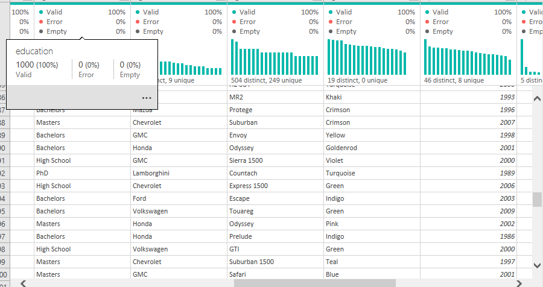
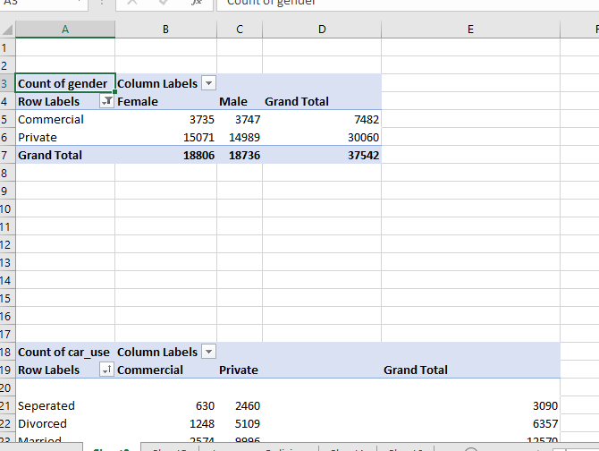
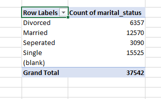
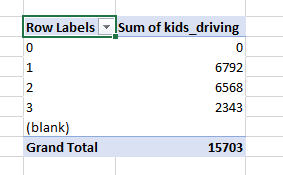
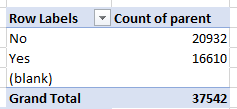

# Car Insurance Analysis

___
## Introduction
This is an Excel project on the sales analysis of a car insurance company. The dataset is named **Car Insurance**
The project is to analyze and derive insight to answer crucial questions on car insurance policies and help the company make data-driven decisions.

**_Disclaimer_**: _All datasets and reports do not represent any company, institution, or country, but just a sample dataset to demonstrate capabilities of Excel._ 

## Problem Statement
1.	What is the total household income per year?
2.	Which year has the highest claim amount?
3.	What is the total number of males to females using car make?
4.	Which car model has the highest claim amount?

## Skills Demonstrated
The following Excel features were incorporated
- Bookmarking,
- Power query
- Pivot tables,
- Page navigation,
- Tables,
- Filters,
- Slices
- and charts.
  Power Query                |      Pivot Tables
  :-------------------------:|:--------------------------:
       |   
  
## Data Sourcing
The dataset was gotten from https://click.convertkit-mail2.com/xmum9lxqnoa6hr97wpgb5h0m00zll/9qhzhdup3qzxmztz/aHR0cHM6Ly9vbnl4ZGF0YS5jby51ay9kYXRhLWRuYS1kYXRhc2V0LWNoYWxsZW5nZS8=

## Data Transformation
Data was loaded into power query to remove nulls, duplicates, and some data type were changed though the data was much cleaner than I thought.

## Modelling
No modelling was done for these datasets because it contains only one table with 16 columns.

## Visualization
Some of the business questions were put into visuals using pie, bar, and line chart. Using those visuals, we check for the following:
You can interact with the report [here](https://1drv.ms/x/s!Ags6B4mGiu5VeJ69cp7i7hEiS1k)

## Analysis
The company currently has a total of 37542 customers with 19 different color types of cars and car_use varies between whether it is private or commercial. The total household income is $5, 527, 962,182 while the average claim amount per year is $34,780,934.74. Most cars' coverage zone is Urban and Customers using Ford are the highest. Most customers are single and most parent driving are those with 1 kid.
Marital Status               | Kids driving                 |  Parents
  :-------------------------:|:--------------------------:  | :------------------:
       |          |  

## Conclusion and Recommendation
- Most customers drive a turquoise color car while few customers drive Mauv color car
- Most customers drive Ford while few customers drive Fairthorpe
- Ford has the highest claim amount of insurance while Rambler has the lowest claim amount.
- Ford has the highest number of frequencies of claim money while Rambler has the lowest
- Most insured cars are from urban and rural areas with the least insured from sub rural
- We have more privately insured cars than commercially insured cars.
- Most customers are single ladies. 🤓
  
   
## Recommendation
Businesses should think of making more packages for commercials cars owners. The prices of insurance should be reviewed according to the type of coverage zone because household income varies and also the datasets of the previous years will be required for comparison and data-driven decision making

